# 🍽️ HOLM My Menu

[](https://hacs.xyz/)


**Les menus de la semaine, vos recettes et la liste de courses, directement dans Home Assistant.**

HOLM My Menu est une intégration **Home Assistant** pensée comme un Mealie en plus simple. Vous gardez vos recettes, vous planifiez le midi et le soir, et la liste de courses se fait toute seule. Les recettes viennent de **Marmiton**, d'un simple lien ou de votre **Mealie**. Les produits viennent d'**Open Food Facts**, avec leur photo et leur fiche complète.

> ✨ **Une seule carte pour tout faire, zéro YAML.** La carte est fournie par l'intégration : aucune ressource Lovelace à ajouter.

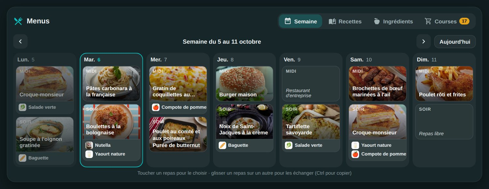

| Une recette | Un repas | Un produit |
|---|---|---|
| 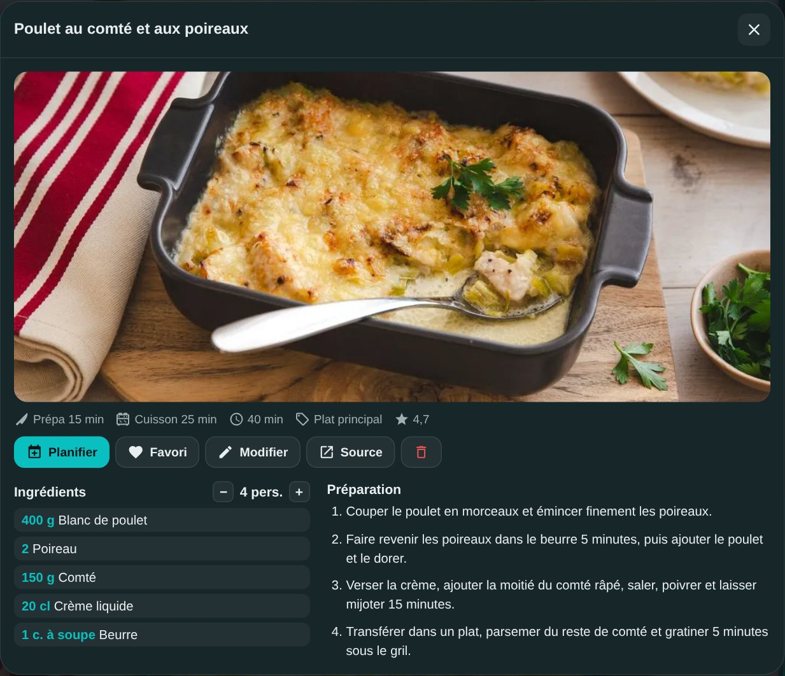 | 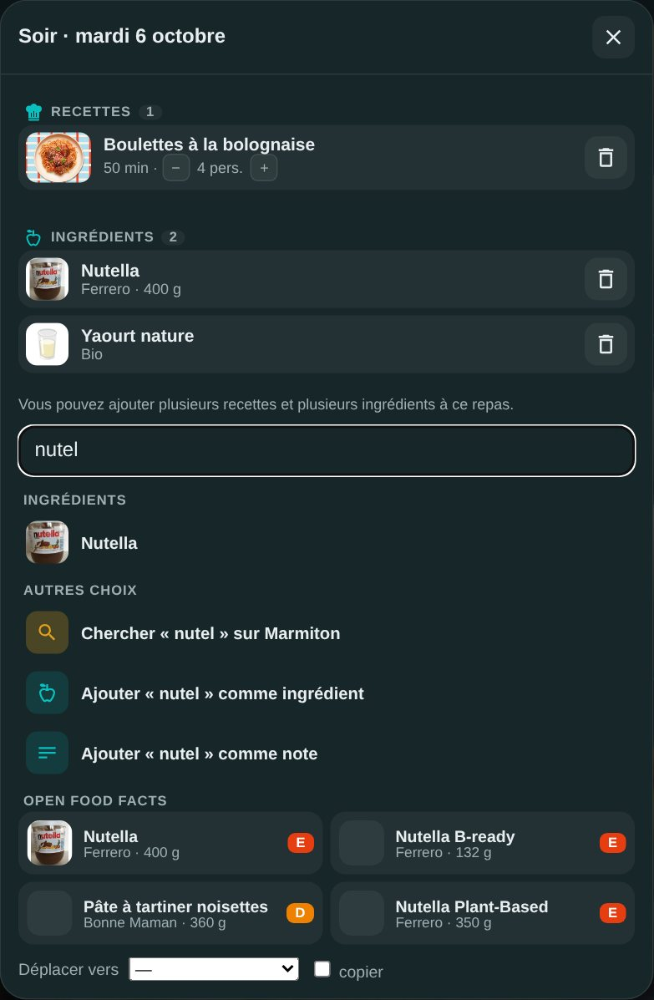 | 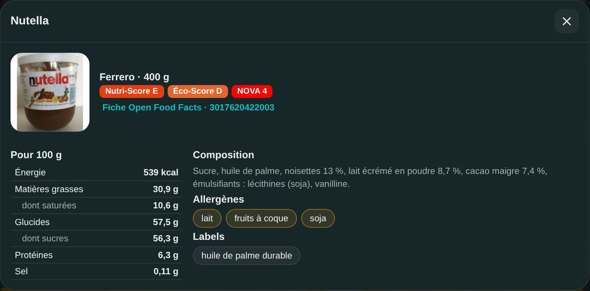 |

### En bref

- 📅 **Planning de la semaine**, midi et soir :
  - plusieurs recettes, ingrédients et notes dans un même repas (un plat, du pain et un yaourt, par exemple) ;
  - glisser un repas sur un autre pour les échanger, avec Ctrl pour copier ;
  - nombre de personnes réglable repas par repas.
- 📖 **Recettes** :
  - **recherche Marmiton**, puis choix du résultat : la recette est importée avec sa photo, ses ingrédients et ses étapes ;
  - import depuis **n'importe quel lien** de recette (tous les sites qui publient le format schema.org) ;
  - import de vos recettes **Mealie** ;
  - saisie à la main, favoris, portions ajustables.
- 🥫 **Ingrédients reliés à vos recettes** :
  - chaque ligne d'une recette est comprise (« 600 g de bœuf haché » donne 600 g de *Bœuf haché*) et reliée à votre base ;
  - le rayon est deviné automatiquement.
- 🔎 **Open Food Facts** : un produit que vous n'avez pas encore se cherche en tapant 3 lettres. Vous obtenez :
  - la photo du produit, enregistrée sur votre Home Assistant ;
  - la marque et le conditionnement ;
  - le Nutri-Score, l'Éco-Score et NOVA ;
  - les valeurs nutritionnelles, la composition, les allergènes et les labels.
- 🛒 **Liste de courses** :
  - générée depuis la semaine choisie, avec les quantités mises à l'échelle et additionnées (1 l + 30 cl de lait = 1,3 l) ;
  - rangée par rayon, avec des articles ajoutés à la main et des cases à cocher en magasin ;
  - **envoi par e-mail à plusieurs personnes** grâce au carnet d'adresses, et/ou en notification sur les téléphones ; copie ou vidage en un geste.
- 📷 **Photos et code-barre** : photo d'une recette prise avec le téléphone ou choisie dans la galerie ; ajout d'un produit en **scannant son code-barre**.
- 📊 **Statistiques** : recettes les plus planifiées, ingrédients les plus utilisés, repas par semaine, taille de la base.
- 🖼️ **Quatre vues pour la carte** :
  - **Complet** pour tout gérer ;
  - **Menu du jour** et **Semaine** en simple consultation, idéales pour une tablette murale. Un toucher sur un plat ou un produit l'affiche en grand ;
  - **Statistiques**.
- 🧩 **Capteurs** pour vos automatisations : menu du midi, menu du soir et prochain repas.

---

## Sommaire

- [Installation](#installation)
- [Configuration](#configuration)
- [La carte `holm-mymenu-card`](#la-carte-holm-mymenu-card)
- [Recettes](#recettes)
- [Ingrédients et Open Food Facts](#ingrédients-et-open-food-facts)
- [Liste de courses](#liste-de-courses)
- [Statistiques](#statistiques)
- [Capteurs](#capteurs)
- [FAQ / dépannage](#faq--dépannage)
- [Crédits & licence](#crédits--licence)

---

## Installation

### Via HACS (recommandé)

1. HACS → menu **⋮** → **Dépôts personnalisés**.
2. Dépôt : `https://github.com/kaaribou/holm-mymenu`. Type : **Intégration**. Cliquez sur **Ajouter**.
3. Recherchez **HOLM My Menu** → **Télécharger**.
4. **Redémarrez** Home Assistant.

### Manuelle

Copiez le dossier `custom_components/holm_mymenu` dans `/config/custom_components/`, puis redémarrez Home Assistant.

> La carte `holm-mymenu-card` est incluse : l'intégration l'ajoute elle-même aux ressources Lovelace et met sa version à jour. **Rien à déclarer à la main.**

---

## Configuration

1. **Paramètres → Appareils et services → Ajouter une intégration → HOLM My Menu.**
2. Indiquez le **nombre de personnes par défaut**.
3. Facultatif, dans **Configurer** (les options de l'intégration) :
   - **Adresse de Mealie** (ex. `http://192.168.1.10:9925`) et **jeton d'API Mealie** (Mealie → Profil → Jetons d'API), pour importer vos recettes Mealie ;
   - le nombre de personnes par défaut peut être changé à tout moment.

Tout est stocké localement dans Home Assistant (`.storage/holm_mymenu`), et les photos dans `www/holm_mymenu/`.

---

## La carte `holm-mymenu-card`

Ajoutez une carte et cherchez **HOLM – My Menu**, ou en YAML :

```yaml
type: custom:holm-mymenu-card
```

| Option | Valeurs | Par défaut | Rôle |
|---|---|---|---|
| `title` | texte | `Menus` | Titre de la carte |
| `view` | `full`, `today`, `week`, `stats` | `full` | **Complet** (gestion), **Menu du jour** ou **Semaine** (consultation), **Statistiques** |
| `tab` | `week`, `recipes`, `ingredients`, `shopping`, `stats` | `week` | Onglet affiché à l'ouverture (vue complète) |
| `today_slots` | `[midi]`, `[soir]`, `[midi, soir]` | les deux | Repas affichés, dans toutes les vues |
| `list_height` | nombre (px), `0` = sans limite | `620` | Hauteur des listes de recettes et d'ingrédients sur ordinateur (sur mobile, c'est la page qui défile) ; la suite se charge au fil du défilement |
| `show_frame` | `true` / `false` | `true` | Afficher le fond et le cadre de la carte |

Toutes ces options se règlent aussi dans l'éditeur visuel.

### Vue complète

Cinq onglets : **Semaine**, **Recettes**, **Ingrédients**, **Courses** et **Stats**.

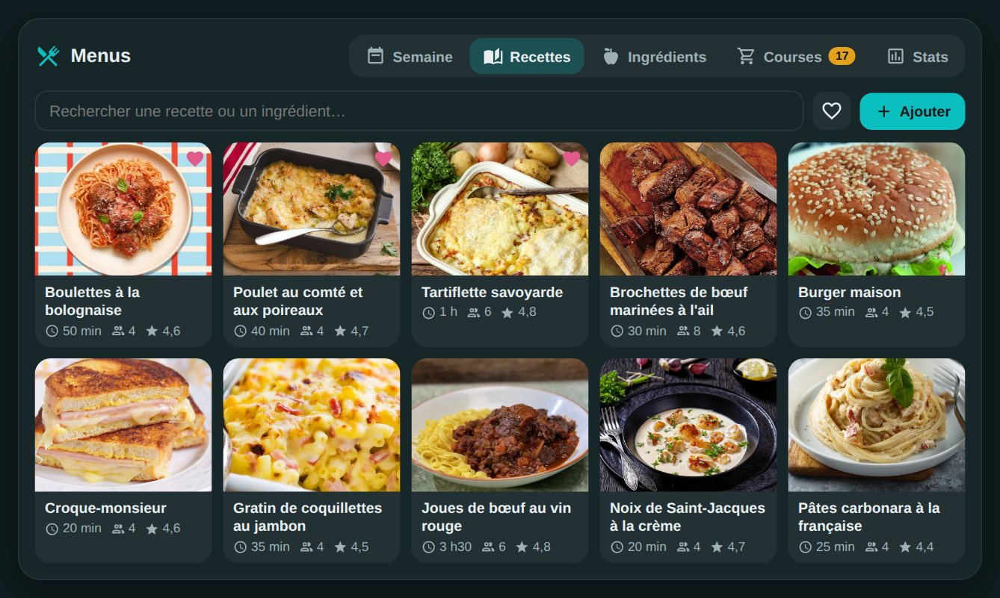

Touchez un repas pour le remplir. Le champ de recherche propose en même temps :

1. vos recettes et vos ingrédients ;
2. une recherche Marmiton ;
3. des produits Open Food Facts ;
4. l'ajout d'un ingrédient ou d'une note libre.

Dans la fenêtre d'un repas, les recettes, les ingrédients et les notes sont séparés. Un toucher ouvre le détail, et la flèche ← ramène au repas.

### Vues « Menu du jour » et « Semaine »

En simple consultation, sans risque de modification. La photo de la recette est en haut, les ingrédients en dessous avec leur photo. Un toucher affiche la recette ou la fiche produit en grand.

| Menu du jour | Semaine |
|---|---|
| 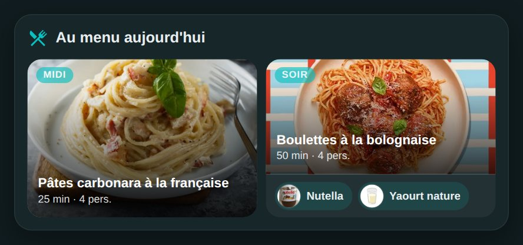 | 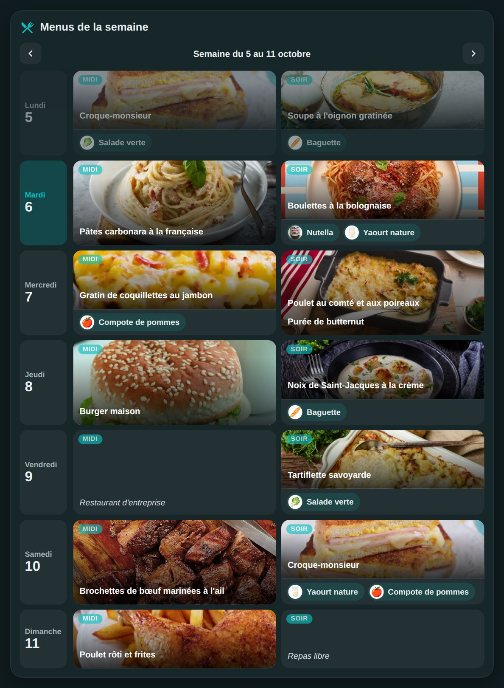 |

```yaml
type: custom:holm-mymenu-card
view: today        # ou week
title: Au menu aujourd'hui
today_slots: [soir]
show_frame: false
```

---

## Recettes

Bouton **Ajouter** de l'onglet Recettes :

- **Marmiton** : tapez « lasagnes », choisissez un résultat, c'est importé.
- **Lien** : collez l'adresse d'une recette, de Marmiton ou d'un autre site qui publie le format schema.org (la plupart des sites de cuisine).
- **Mealie** : cochez les recettes à importer (adresse et jeton dans les options de l'intégration). Les recettes déjà importées sont signalées.
- **À la main** : nom, portions, temps, une ligne par ingrédient, une ligne par étape, et une **photo** : *Choisir une photo* (galerie du téléphone ou fichier) ou *Prendre une photo* avec l'appareil. Elle est réduite avant l'envoi et enregistrée sur votre Home Assistant.

Dans la fiche d'une recette, vous pouvez :

- changer le nombre de personnes : les quantités suivent ;
- la planifier sur un repas des deux prochaines semaines ;
- la mettre en favori, la modifier ou ouvrir la recette d'origine ;
- toucher un ingrédient pour ouvrir sa fiche.

---

## Ingrédients et Open Food Facts

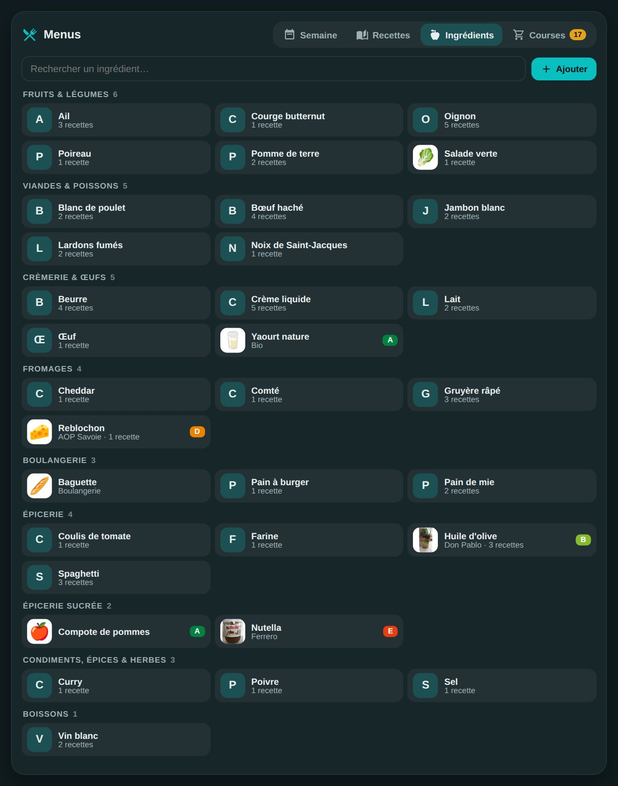

- Les ingrédients sont créés automatiquement à l'import des recettes, sans doublon (« oignons » et « oignon » donnent le même ingrédient).
- **Ajouter** cherche dans votre base et sur Open Food Facts. Choisissez un produit : sa fiche complète et sa photo sont enregistrées.
- **Scanner** lit le code-barre d'un produit avec la caméra du téléphone ; vous pouvez aussi photographier le code ou taper son numéro (directement dans la recherche, par exemple `3017620422003`). La fiche Open Food Facts s'affiche, un toucher l'ajoute.
  - Sur iPhone et iPad, la lecture passe par une petite bibliothèque chargée depuis Internet au moment du scan.
- Dans la fiche d'un ingrédient, vous pouvez :
  - modifier le nom, le rayon, la marque, le conditionnement et une note ;
  - choisir ou prendre une photo ;
  - associer un produit Open Food Facts, ou en changer ;
  - voir les recettes qui l'utilisent.

---

## Liste de courses

| La liste | L'envoi |
|---|---|
| 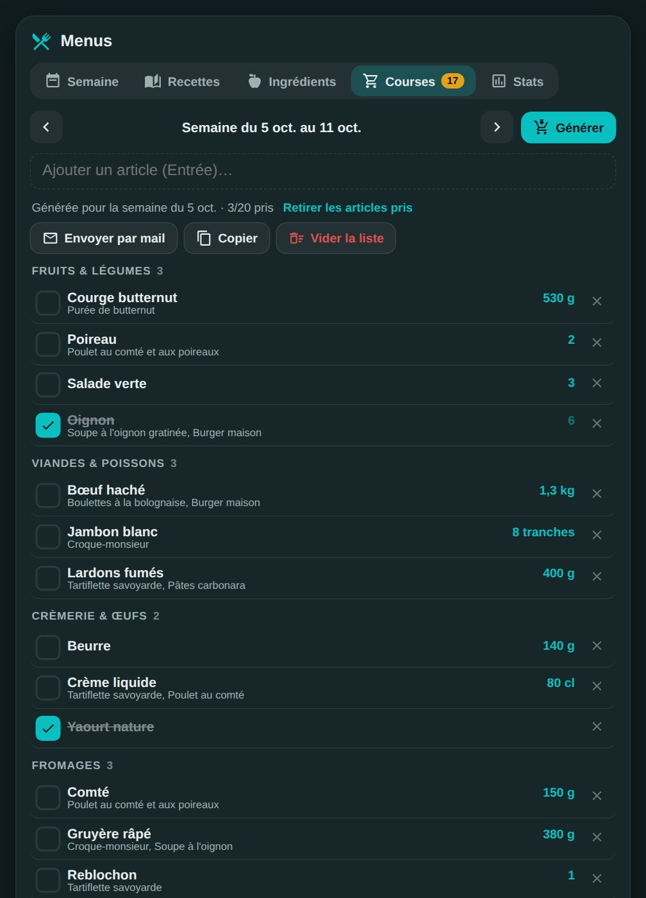 | 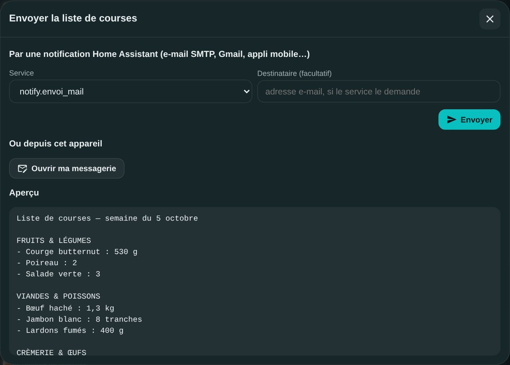 |

- Choisissez la semaine et touchez **Générer** : les ingrédients des repas prévus sont mis à l'échelle du nombre de personnes, additionnés et rangés par rayon.
- Les articles déjà cochés et ceux ajoutés à la main sont conservés quand vous régénérez la liste.
- **Envoyer par mail** ouvre la fenêtre d'envoi :
  - un **carnet d'adresses** (Oliv, Ln, Margaux…) : cochez les personnes, ajoutez-en ou retirez-en ; vos choix sont retenus pour la fois suivante ;
  - **un seul e-mail** part vers toutes les adresses cochées, mis en forme par rayon avec une case à cocher par article. Il utilise les réglages de votre intégration **SMTP** de Home Assistant (serveur, identifiants, expéditeur) : rien à ressaisir, et aucune adresse à déclarer comme destinataire SMTP ;
  - les **téléphones et tablettes** (entités de notification) peuvent aussi être cochés : ils reçoivent la liste en notification ;
  - **Ouvrir ma messagerie** prépare le même message dans la messagerie de l'appareil, avec les adresses cochées.
- **Copier** met la liste dans le presse-papiers. **Vider la liste** repart de zéro.

---

## Statistiques

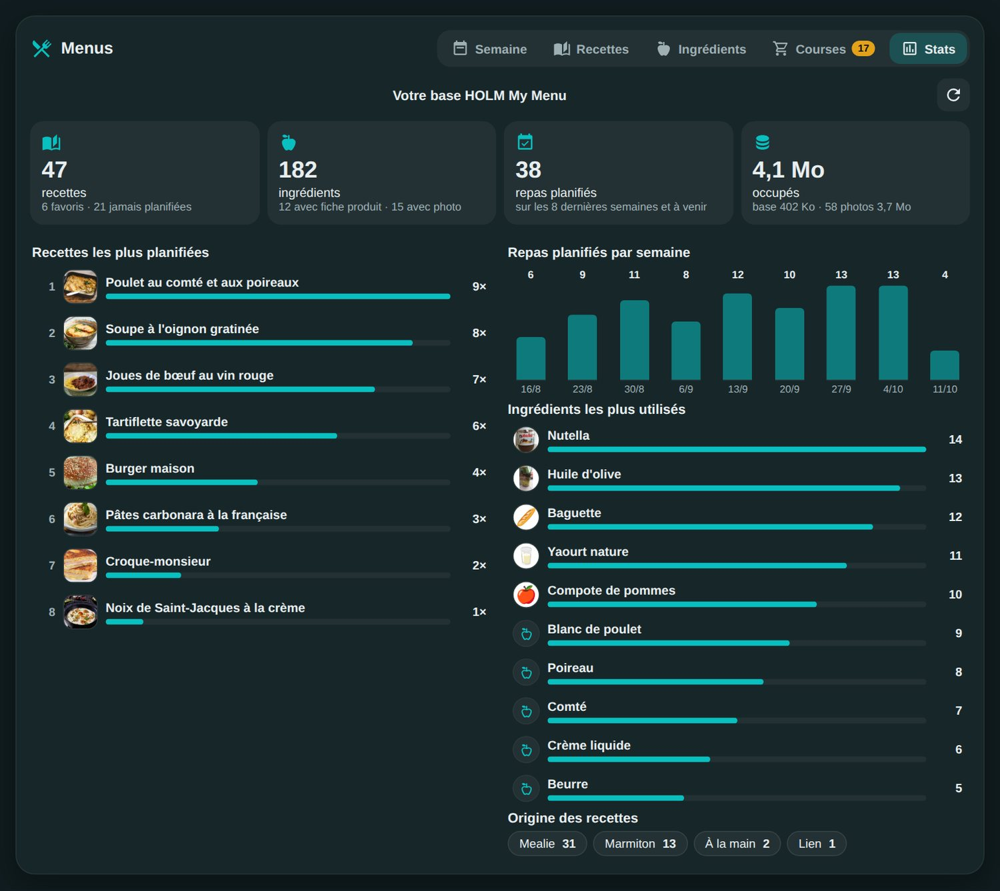

L'onglet **Stats** (ou une carte dédiée avec `view: stats`) montre :

- les chiffres clés : recettes (favorites, jamais planifiées), ingrédients (avec fiche produit, avec photo), repas planifiés, place occupée par la base et les photos ;
- les **recettes les plus planifiées**, avec le nombre de fois et la dernière date ; un toucher ouvre la recette ;
- les **ingrédients les plus utilisés** (selon les recettes planifiées) ;
- les **repas planifiés par semaine** sur les 8 dernières semaines ;
- l'origine des recettes (Marmiton, Mealie, lien, à la main).

Le compteur est conservé indéfiniment, même quand l'historique du planning est nettoyé.

```yaml
type: custom:holm-mymenu-card
view: stats
title: Nos habitudes
```

---

## Capteurs

| Entité | État | Attributs |
|---|---|---|
| `sensor.holm_mymenu_midi` | menu du midi | `date`, `slot`, `recipes` (nom, durée, portions), `entries` |
| `sensor.holm_mymenu_soir` | menu du soir | idem |
| `sensor.holm_mymenu_next` | prochain repas prévu | idem |

L'image de l'entité est la photo de la recette. Exemple : annoncer le menu du soir sur l'enceinte de la cuisine.

```yaml
automation:
  - alias: Annonce du menu du soir
    triggers:
      - trigger: time
        at: "18:30:00"
    conditions:
      - condition: not
        conditions:
          - condition: state
            entity_id: sensor.holm_mymenu_soir
            state: Rien de prévu
    actions:
      - action: tts.speak
        target:
          entity_id: tts.google_translate_fr_fr
        data:
          media_player_entity_id: media_player.cuisine
          message: "Ce soir au menu : {{ states('sensor.holm_mymenu_soir') }}"
```

---

## FAQ / dépannage

**« Custom element doesn't exist: holm-mymenu-card ».**
Vérifiez dans *Paramètres → Tableaux de bord → ⋮ → Ressources* que `/holm_mymenu_static/holm-mymenu-card.js` est présent (l'intégration l'ajoute au démarrage ; en mode YAML, ajoutez-le vous-même en type *module*). Puis rechargez avec **Ctrl + Maj + R**. Dans l'application mobile : Paramètres → Application compagnon → Débogage → **Réinitialiser le cache du frontend**.

**La recherche Open Food Facts ne répond pas.**
Open Food Facts est un service gratuit, parfois saturé. Réessayez un peu plus tard. Vous pouvez aussi ajouter l'ingrédient sans produit et l'associer plus tard depuis sa fiche.

**Une recette Marmiton ne s'importe pas.**
Marmiton peut changer sa page. Essayez l'import par **Lien** ; sinon, ouvrez une issue avec l'adresse de la recette.

**L'envoi par e-mail échoue.**
L'envoi utilise l'intégration **SMTP** de Home Assistant : vérifiez qu'elle est configurée et qu'elle fonctionne. Pour Gmail, il faut un *mot de passe d'application*. Sans intégration SMTP, utilisez « Ouvrir ma messagerie ».

**Le scanner ne s'ouvre pas.**
Le navigateur doit avoir l'autorisation d'utiliser la caméra, et Home Assistant doit être ouvert en HTTPS. Sinon, *Photographier le code* ou tapez son numéro.

**Mobile : à la première photo, l'application revient à l'accueil de Home Assistant.**
C'est l'application Home Assistant qui se recharge après la demande d'autorisation de la caméra. Choisissez « Pendant l'utilisation de l'application » : la question ne revient plus, et il suffit de rouvrir la page des menus cette fois-là.

**Mealie : « Jeton Mealie refusé ».**
Créez un nouveau jeton dans Mealie (Profil → Jetons d'API) et collez-le dans les options de l'intégration.

**Les photos sont-elles stockées chez moi ?**
Oui. Les photos des recettes et des produits sont copiées dans `www/holm_mymenu/` : la carte ne dépend pas de sites extérieurs pour les afficher.

---

## Un petit merci ?

HOLM My Menu vous fait gagner du temps chaque semaine ? Vous pouvez m'offrir une bière 🍺

[](https://paypal.me/kaaribou)

---

## Crédits & licence

- Données produits : [Open Food Facts](https://fr.openfoodfacts.org) (licence ODbL).
- Recettes : [Marmiton](https://www.marmiton.org) et les sites d'origine, pour votre usage personnel ; [Mealie](https://mealie.io) pour l'import.
- Code : licence **MIT** — © kaaribou.

Voir le [CHANGELOG](CHANGELOG.md).

Fait partie de **HOLM — Home Orchestration & Living Management** : la gestion et l'orchestration intelligente de la maison.

Les autres projets : [Volets HOLM](https://github.com/kaaribou/volets-holm) · [Climat HOLM](https://github.com/kaaribou/climat-holm) · [Carburant HOLM](https://github.com/kaaribou/carburant-holm) · [Commandes à la maison HOLM](https://github.com/kaaribou/commandes-holm) · [HOLM Navbar Card](https://github.com/kaaribou/holm-navbar-card) · [HOLM Climate Card](https://github.com/kaaribou/climate-card-holm) · [HOLM Music Card](https://github.com/kaaribou/holm-music-card) · [HOLM Sentinel Card](https://github.com/kaaribou/holm-sentinel-card) · [HOLM Security Card](https://github.com/kaaribou/holm-security-card) · [HOLM Recordings Card](https://github.com/kaaribou/holm-recordings-card) · [HOLM Covers Card](https://github.com/kaaribou/holm-covers-card) · [HOLM Power Flow Card](https://github.com/kaaribou/holm-power-flow-card) · [HOLM Energy Cards](https://github.com/kaaribou/holm-energy-cards) · [HOLM Radiator Card](https://github.com/kaaribou/holm-radiator-card) · [HOLM Floor Card](https://github.com/kaaribou/holm-floor-card) · [HOLM Smoke Card](https://github.com/kaaribou/holm-smoke-card) · [HOLM BG Card](https://github.com/kaaribou/holm-bg-card).
